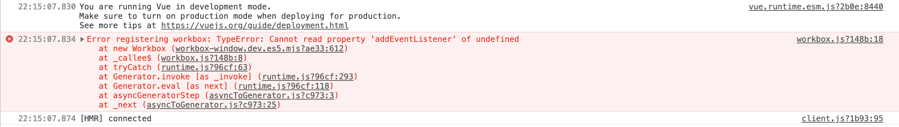

# nuxt-pwa-hostname-issue

This repo shows an issue with nuxt-pwa (workbox) and the `--hostname` option on the nuxt command when `dev` is set to `true`.

## Reproduce Issue

1. Create a simple nuxt app

2. Install the PWA module with
   >`yarn add --dev @nuxtjs/pwa`

1. Add the PWA module to `nuxt.config.js` and set `dev: true`
   > See https://pwa.nuxtjs.org/setup

2. Add `--hostname` option to `nuxt` command in package.json
   > See https://nuxtjs.org/faq/host-port/

3. Start app and see error in Chrome Dev Tools:
   ```log
   Error registering workbox: TypeError: Cannot read property 'addEventListener' of undefined
    at new Workbox (workbox-window.dev.es5.mjs?ae33:612)
    at _callee$ (workbox.js?148b:8)
    at tryCatch (runtime.js?96cf:63)
    at Generator.invoke [as _invoke] (runtime.js?96cf:293)
    at Generator.eval [as next] (runtime.js?96cf:118)
    at asyncGeneratorStep (asyncToGenerator.js?c973:3)
    at _next (asyncToGenerator.js?c973:25)
    ```
    